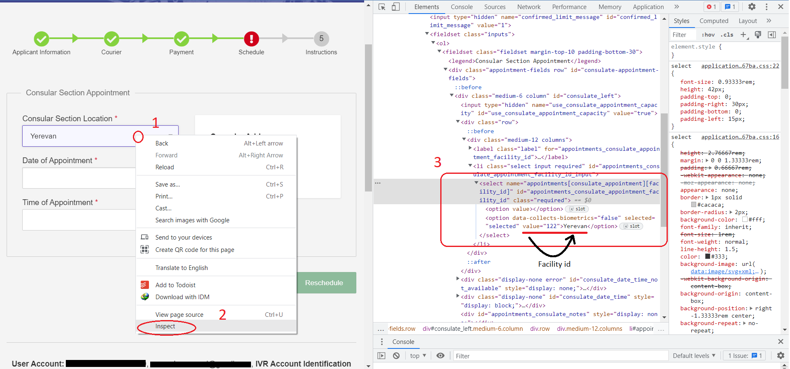

# visa_rescheduler
The `visa_rescheduler` is a bot for monitoring US VISA (usvisa-info.com) appointment available dates. It can automatically reschedule to the earliest date it finds on your behalf, and optionally notify you when that happens.

## Prerequisites
- Having a US VISA appointment scheduled already.
- [Optional] API token from Pushover and/or a Sendgrid (for notifications)(You also can use the `esender.php` file in this repo as an email pusher on your website)

## How to use
Following steps are tested on Windows.

This project contains a Python script `visa.py` that runs on your local machine, so you will need Python and a browser (currently only supports Google Chrome) installed on your local machine.

### 1. Install dependency
1. Install Google Chrome [for install goto: https://www.google.com/chrome/]
2. Install Python v3 [for install goto: https://www.python.org/downloads/]
3. Install the required python packages: Just run the bat file in the Microsoft Windows. Or run the below commands:
    ```
    pip install requests==2.27.1
    pip install selenium==4.2.0
    pip install webdriver-manager==3.7.0
    pip install sendgrid==6.9.7
    ```

### 2. Provide your appointment information
In order to find the next available date, this program needs to know your appointment information. To do this, open and edit `config.ini` file:

1. You should fill everything in the `[PERSONAL_INFO]` section with your account and appointment information.
2. You should configure at least 1 method of notification under the `[NOTIFICATION]` section. You can use both of them at the same time. (See Configure notification section for more details)

### 3. Run the script

Open a terminal(windows powershell) and run the below command:
```
python.exe .\visa.py
```

If all dependencies are installed correctly, the script will start running. You can see the logs in the terminal, and the Chrome browser will be opened. From here, just leave the program running. When a available date is found, the program will notify you using the services you have configured in the config.ini file.

To stop the program, just close the terminal or press Ctrl+C.

## Configure notification

You can configure to receive notification when the program finds a date and attempts rescheduling. To do this, you should configure at least one of the notification methods in the `config.ini` file. You can use both of them at the same time.

### Phone notification using Pushover

In summary, you will need 1) a Pushover account and 2) Create an Application under your Pushover account.

1. Go to https://pushover.net/ and create an account.
2. Go to https://pushover.net/, log into your account. Scroll down and click on "Create an Application/API Token"
3. Replace the `PUSHOVER_TOKEN` and `PUSHOVER_USER` in the `config.ini` file with your own keys.

### Email notification using SendGrid

TODO

## How to add new embassy
There are too many embassies on the world, this program cannot support all of them. You can easily add the missing embassies yourself.

- First check if the embassy your are looking for is already supported, by checking `embassy.py` file. If it is not there, you should add it yourself.
- To add a new embassy (using English), you should find the embassy's "facility id." To do this, using google chrome, on the booking page of your account, right-click on the location section, then click "inspect." Then the right-hand window will be opened, highlighting the "select" item. You can find the "facility id" here and add this facility id in the 'embassy.py' file. There might be several facility ids for several different embassies. They can be added too. Please use the picture below as an illustration of the process.



## TODO
- Make timing optimum. (There are lots of unanswered questions. How is the banning algorithm? How can we avoid it? etc.)
- Adding a GUI (Based on PyQt)
- Multi-account support (switching between accounts in Resting times)
- Add a sound alert for different events.
- Extend the embassies list.

## Acknowledgement
Thanks to everyone who participated in this repo. Lots of people are using your excellent product without even appreciating you.
